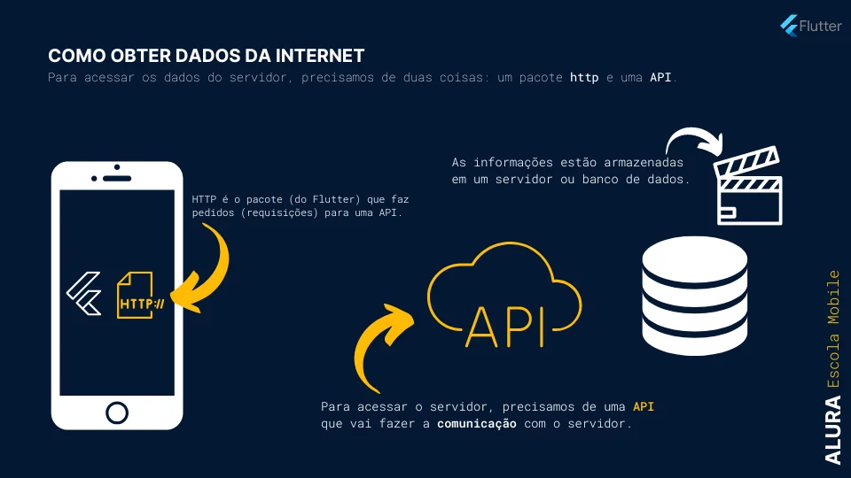
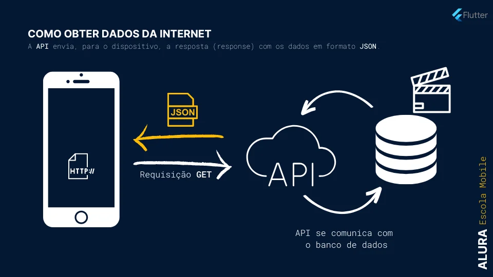
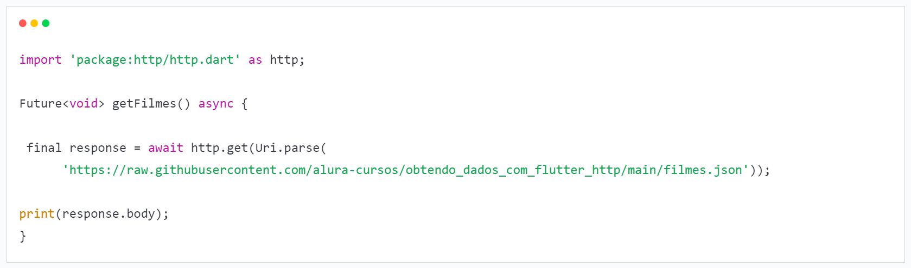
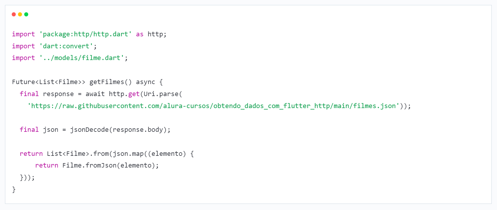

<i>Anotações com o que foi aprendido no curso da Alura: Flutter com WebAPI : Integrando sua aplicação. Além do artigo sobre HTTP com o exemplo de lista de filmes do Studi Ghibli </i>

## HTTP

- Para realizar uma comunicação com a internet, afim de obter dados do servidor, utilizamos o HTTP, onde possui um pacote do Flutter que podemos utilizar pra criar nossas requisições e obter nossas respostas.

## TIPOS DE REQUISIÇÕES (REQUEST)

- Existem várias formas de utilizar os dados obtidos através de uma requisição, entre as mais conhecidas, temos:
    - GET: É utilizado para pegar os dados da internet.
    - POST: É utilizar para salvar novos dados.
    - PUT: Atualiza os dados já existentes (update).
    - DELETE: Deleta os dados.

## RESPOSTA (RESPONSE) E STATUS CODE

- Além da requisição, precisamos da resposta do nosso pedido, e dependendo da forma que solicitamos e do servidor, podemos obter vários tipos de respostas, onde utilizamos o status code para medir essa resposta:

    - Respostas informativas (100 a 199);
    - Respostas bem-sucedidas (200 a 299);
    - Mensagens de redirecionamento (300 a 399);
    - Respostas de erro do cliente (400 a 499);
    - Respostas de erro do servidor (500 a 599).

## CRIANDO UMA REQUISIÇÃO GET

- No código acima criamos uma função assíncrona pois precisamos utilizar o await já que a requisição pode demorar para retornar e precisamos dela para continuar o código, e como os dados não irão aparecer de forma instântanea, precisamos declarar que o retorno dele é um Future do tipo void e não apenas void. Utilizamos void pois iremos apenas printar o conteúdo no console da IDE. 

- Por que esse Uri.parse?
- O método get do http.get, necessita que o conteúdo passado entre os parâmetros sejam um URI (identificador de recurso), onde para isso precisamos realizar a conversão do nosso link para ser um tipo URI. O URI é semelhante a URL porém ela apenas identifica o recurso e não localiza. O objetivo da URL é interligar o nosso recurso da internet com um endereço. Já a URI é apenas identificar o recurso:
    - URI: Uniform Resource Identifier
    - URL: Uniform Resource Locator

- E o response.body?
- O body é tudo que contém no nosso arquivo JSON, pois os dados retornados pela API está em formato JSON.

<i>Ler depois: https://www.alura.com.br/artigos/construtores-dart-tipos-como-usa-los </i>

## CONVERTENDO JSON EM OBJETO

- Para converter um json em um objeto, escrevemos o seguinte código:

